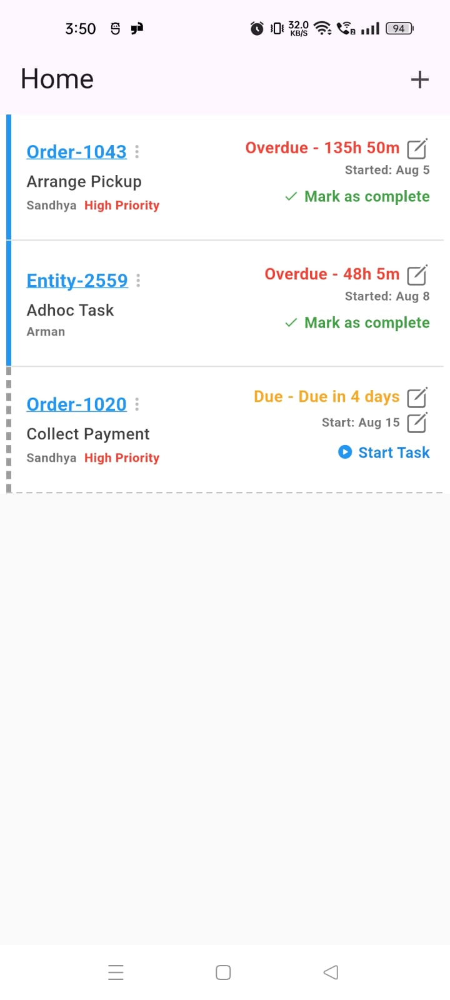

# Railse Assignment

A Flutter task management application built with BLoC pattern architecture.

## Features Implemented

This application demonstrates the following task management interactions:

### ✅ Task Status Management
- **Start Task**: A "Not Started" task displays a "Start Task" button. Tapping it changes the task's status to "Started" and updates the UI.
- **Mark as Complete**: A "Started" task displays a "Mark as Complete" button. Tapping it changes the status to "Completed" and updates the UI.

### ✅ Date Management
- **Edit Deadline**: Tapping the date on any active task (i.e., "Not Started" or "Started") opens a date picker. Saving a new date updates that task's start date and refreshes the UI.
- **Edit Icon for Start Date**: An edit icon is displayed next to the start date only for tasks that have a "Not Started" status.

## Architecture

This project is built using the **BLoC (Business Logic Component) pattern** architecture:

- **BLoC Pattern**: Implements clean separation of business logic from UI
- **State Management**: Uses BLoC for reactive state management
- **Event-Driven**: UI events trigger BLoC events which update the state
- **Repository Pattern**: Data layer abstraction for better testability

### Project Structure
```
lib/
├── features/
│   └── home/
│       ├── bloc/           # BLoC files (events, states, bloc)
│       ├── data/           # Data models and repositories
│       └── view/           # UI screens and widgets
└── main.dart
```

## Screenshots

### Main Application Interface


## Video Demonstration

Watch the application in action:
[](assets/railse_video.mp4)

*Click the image above to view the video demonstration*

## Getting Started

This project is a starting point for a Flutter application.

A few resources to get you started if this is your first Flutter project:

- [Lab: Write your first Flutter app](https://docs.flutter.dev/get-started/codelab)
- [Cookbook: Useful Flutter samples](https://docs.flutter.dev/cookbook)

For help getting started with Flutter development, view the
[online documentation](https://docs.flutter.dev/), which offers tutorials,
samples, guidance on mobile development, and a full API reference.

## Dependencies

The project uses the following key dependencies:
- `flutter_bloc`: For BLoC pattern implementation
- `equatable`: For value equality comparisons
- `intl`: For date formatting

## Running the Project

1. Ensure you have Flutter installed and set up
2. Clone this repository
3. Run `flutter pub get` to install dependencies
4. Run `flutter run` to start the application
